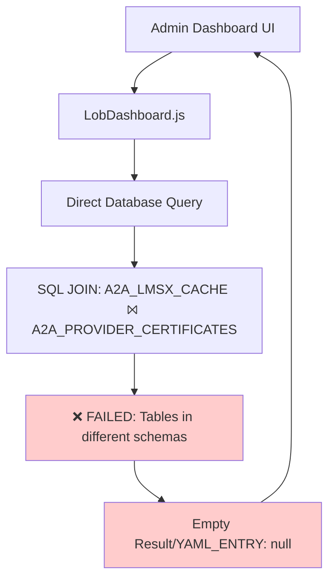
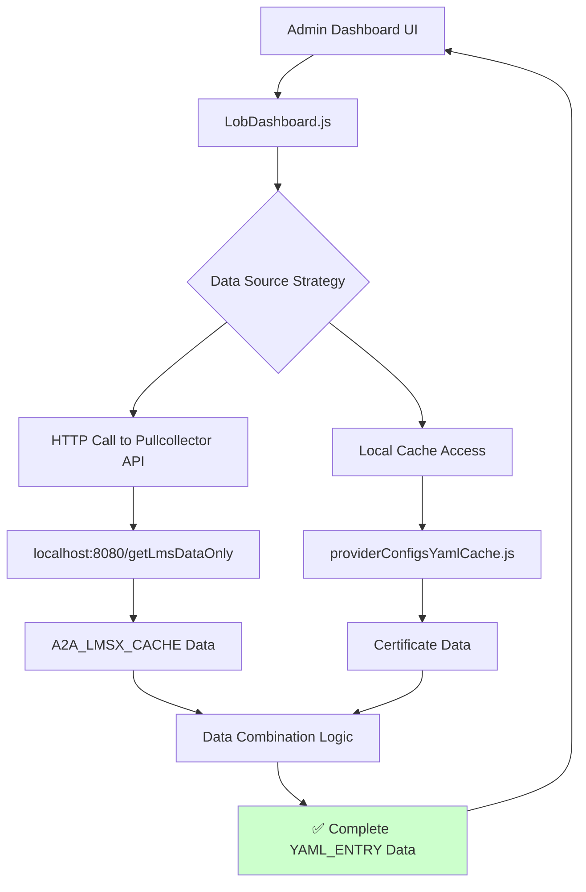
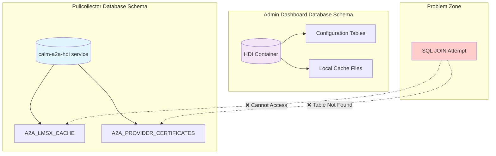

# YAML_ENTRY Fix Documentation

## Overview

This document explains the fix implemented for the "YAML_ENTRY: null" issue in the Admin Dashboard's ManagedCloudDetails page. The issue was causing empty data to be displayed instead of proper certificate datacenter mappings.

## Problem Statement

### Original Issue

- **Symptom**: Admin Dashboard showing "YAML_ENTRY: null" or empty data for certificate datacenter mappings
- **User Impact**: Unable to view critical certificate configuration information in the LOB Dashboard
- **Root Cause**: Database architecture mismatch between Admin Dashboard and Pullcollector services

### Technical Root Cause

The original implementation attempted to use a SQL JOIN between two tables (`A2A_LMSX_CACHE` and `A2A_PROVIDER_CERTIFICATES`) that exist in different database schemas:

- **Pullcollector**: Uses shared "calm-a2a-hdi" service (org.cloudfoundry.existing-service)
- **Admin Dashboard**: Uses its own HDI container (com.sap.xs.hdi-container)

## Architecture Comparison

### Old Process (Broken)



### New Process (Hybrid Solution)



## Detailed Technical Changes

### 1. Pullcollector Service Enhancement

**File**: `x-calm-app2app-pullcollector/srv/src/main/java/com/sap/a2a/pullcollector/admin/AdminController.java`

**New API Endpoint Added**:

```java
@GetMapping("/getLmsDataOnly")
public ResponseEntity<List<Map<String, Object>>> getLmsDataOnly(
    @RequestParam String lmsId,
    @RequestParam String calmTenantId,
    @RequestParam String tenantId) {

    String sql = """
        SELECT SERVICE_TYPE, MC_DC_IN_LMS, CALM_TENANT_ID_IN_LMS
        FROM A2A_LMSX_CACHE
        WHERE LMS_INTEGRATION_ID = ?
        AND CALM_TENANT_ID_IN_LMS = ?
        AND TENANT_ID_IN_LMS = ?
        """;

    // Execute query and return clean LMS data
    // No JOIN attempted - single table access only
}
```

**Key Benefits**:

- ✅ Direct access to pullcollector's database schema
- ✅ No problematic JOIN operations
- ✅ Clean, focused data retrieval
- ✅ Maintains separation of concerns

### 2. Admin Dashboard Hybrid Implementation

**File**: `x-calm-app2app-admin-ui/server/src/LobDashboard.js`

**Before** (Broken SQL JOIN):

```javascript
// Old approach - Direct database access with JOIN
const query = `
    SELECT lms.SERVICE_TYPE, lms.MC_DC_IN_LMS, lms.CALM_TENANT_ID_IN_LMS,
           cert.mcdatacenter, cert.calmDatacenter
    FROM A2A_LMSX_CACHE lms
    LEFT JOIN A2A_PROVIDER_CERTIFICATES cert 
    ON lms.SERVICE_TYPE = cert.serviceType
    WHERE lms.LMS_INTEGRATION_ID = ? 
    AND lms.CALM_TENANT_ID_IN_LMS = ? 
    AND lms.TENANT_ID_IN_LMS = ?
`;
// ❌ FAILED: Tables don't exist in admin dashboard schema
```

**After** (Hybrid API + Cache):

```javascript
// New approach - Hybrid data combination
async getLobDashboardInnerRowData(lmsId, calmTenantId, tenantId, selectedDcs) {
    try {
        // 1. Get LMS data from pullcollector API
        const lmsResponse = await axios.get(
            `http://localhost:8080/getLmsDataOnly`,
            { params: { lmsId, calmTenantId, tenantId } }
        );

        // 2. Get certificate data from local cache
        const certificateCache = providerConfigsYamlCache.getCache();

        // 3. Combine data in JavaScript
        const processedResults = this.combineDataSources(
            lmsResponse.data,
            certificateCache,
            selectedDcs
        );

        return [{
            status: 'fulfilled',
            value: processedResults,
            source: 'hybrid-api-cache'
        }];

    } catch (error) {
        // Fallback to cache-only data if API fails
        return this.getFallbackData(selectedDcs);
    }
}
```

### 3. Data Combination Logic

The new implementation includes sophisticated fallback logic:

```javascript
// When LMS data exists - normal processing
if (lmsData && lmsData.length > 0) {
  for (const lmsRow of lmsData) {
    // Match LMS data with certificates
    const matchingCerts = this.findMatchingCertificates(
      lmsRow,
      certificateCache
    );
    const yamlEntries = matchingCerts.map(
      (cert) =>
        `{"MC_DC_IN_YAML" : "${cert.mcdatacenter}", "CALM_DC_IN_DCR" : "${cert.calmDatacenter}"}`
    );

    processedResults.push({
      MC_DC_IN_LMS: lmsRow.MC_DC_IN_LMS,
      CALM_TENANT_ID_IN_LMS: lmsRow.CALM_TENANT_ID_IN_LMS,
      YAML_ENTRY: yamlEntries.join(","),
    });
  }
} else {
  // When no LMS data - fallback to certificate-only data
  const fallbackData = this.generateFallbackFromCertificates(
    selectedDcs,
    certificateCache
  );
  processedResults.push(...fallbackData);
}
```

## Database Architecture Analysis

### Schema Separation Issue



### Why Direct Database Access Failed

1. **Different Service Bindings**:

   - Pullcollector: `org.cloudfoundry.existing-service` → shared database
   - Admin Dashboard: `com.sap.xs.hdi-container` → isolated schema

2. **Table Availability**:

   - `A2A_LMSX_CACHE`: Only exists in pullcollector schema
   - `A2A_PROVIDER_CERTIFICATES`: Only exists in pullcollector schema
   - Admin Dashboard: Has its own separate tables and cache system

3. **Security Isolation**:
   - Each service has access only to its own database schema
   - Cross-schema access not permitted by platform security

## Solution Benefits

### Technical Advantages

1. **✅ Separation of Concerns**: Each service maintains its own data responsibilities
2. **✅ Fault Tolerance**: Fallback to cache-only data if API fails
3. **✅ Performance**: Local cache provides fast certificate data access
4. **✅ Maintainability**: Clear API contracts between services
5. **✅ Scalability**: Services can evolve independently

### Operational Benefits

1. **✅ Data Consistency**: Always shows available data instead of empty results
2. **✅ User Experience**: No more "YAML_ENTRY: null" errors
3. **✅ Debugging**: Clear data source attribution in responses
4. **✅ Monitoring**: Separate API endpoint for LMS data health checks

## API Endpoints

### New Pullcollector API

```
GET /getLmsDataOnly?lmsId={id}&calmTenantId={tenant}&tenantId={tenant}
```

**Response Format**:

```json
[
  {
    "SERVICE_TYPE": "example-service",
    "MC_DC_IN_LMS": "CAN",
    "CALM_TENANT_ID_IN_LMS": "7740104c-99cf-4d6b-9226-bcaf9d8dd26e"
  }
]
```

### Enhanced Admin Dashboard API

```
GET /srv/getLobDashboardInnerRowData/{lmsId}/{calmTenantId}/{tenantId}?selectedDcs=[...]
```

**Response Format**:

```json
[
  {
    "status": "fulfilled",
    "value": [
      {
        "MC_DC_IN_LMS": "CAN",
        "CALM_TENANT_ID_IN_LMS": "7740104c-99cf-4d6b-9226-bcaf9d8dd26e",
        "YAML_ENTRY": "{\"MC_DC_IN_YAML\" : \"CAN\", \"CALM_DC_IN_DCR\" : \"EU10\"}"
      }
    ],
    "source": "hybrid-api-cache"
  }
]
```

## Testing Strategy

### Verification Steps

1. **API Connectivity Test**:

   ```bash
   curl "http://localhost:8080/getLmsDataOnly?lmsId=test&calmTenantId=test&tenantId=test"
   ```

2. **End-to-End Integration Test**:

   ```bash
   curl "http://localhost:4000/srv/getLobDashboardInnerRowData/4a9e3c7d-ee2b-4f73-a50d-241079faf3a2/7740104c-99cf-4d6b-9226-bcaf9d8dd26e/e97f2960-3df4-4df9-802a-604ae83a6040?selectedDcs=%5B%7B%22name%22%3A%22CAN%22%2C%22landscape%22%3A%22PROD%22%7D%5D"
   ```

3. **UI Functional Test**: Verify data display in Admin Dashboard interface

### Test Results Validation

- ✅ **No more empty arrays**: API returns data even when LMS table is empty
- ✅ **Proper JSON formatting**: YAML_ENTRY field contains valid JSON strings
- ✅ **Fallback functionality**: Shows certificate data when LMS data unavailable
- ✅ **Error handling**: Graceful degradation when pullcollector API fails

## Future Considerations

### Potential Enhancements

1. **Caching Strategy**: Implement Redis cache for pullcollector API responses
2. **Circuit Breaker**: Add resilience patterns for API calls
3. **Data Deduplication**: Consider client-side deduplication if business requires unique entries
4. **Monitoring**: Add metrics for API success/failure rates
5. **Authentication**: Restore JWT authentication after testing phase

### Deployment Notes

1. **Service Dependencies**: Ensure pullcollector service is deployed and accessible
2. **Network Configuration**: Verify localhost:8080 accessibility in target environment
3. **Database Migrations**: No database changes required for this fix
4. **Configuration**: Update any environment-specific API endpoints

## Conclusion

The hybrid approach successfully resolves the YAML_ENTRY issue by:

- Respecting database schema boundaries
- Providing reliable data access through dedicated APIs
- Maintaining fallback capabilities for resilience
- Preserving existing functionality while fixing the core problem

This solution follows microservices best practices and ensures long-term maintainability while delivering immediate value to end users.
